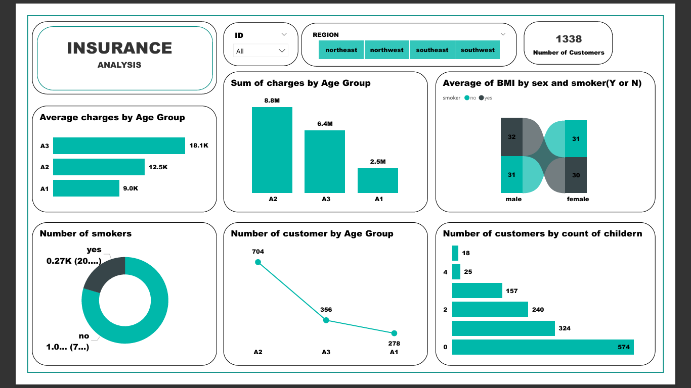

# Health Insurance Data Analysis

## Overview

This project explores and analyzes health insurance and dental plan data from the U.S. Department of Health and Human Services for the years 2014-2016. It covers health insurance premiums, comparing rates for smokers and non-smokers, age groups, and state-level variations. Using Python and various libraries like Pandas and Seaborn, this analysis identifies significant trends, regional pricing disparities, and other key insights.

The analysis includes a Power BI dashboard for data visualization, showcasing important metrics and findings such as premium trends, smoker vs. non-smoker cost differences, and state-level pricing variations.

## Data Source

The data used in this project is available from the [U.S. Department of Health and Human Services](https://www.cms.gov/cciio/resources/data-resources/marketplace-puf.html) and the [Kaggle Health Insurance Marketplace dataset](https://www.kaggle.com/hhs/health-insurance-marketplace).

## Project Details

- **Data Cleaning**: We cleaned and processed over 12 million records across 39 states, addressing missing values, duplicate entries, and outliers.
- **Analysis**: We conducted a statistical analysis on premium trends, comparing costs for smokers vs. non-smokers, age groups, and state-level variations.
- **Visualization**: We developed interactive visualizations using Power BI to provide insights into key metrics like premium distribution, smoker vs. non-smoker rates, and regional disparities.
  
### Key Insights

1. **Premium Trends**: Significant increase in premiums for non-smokers from 2014-2016. Smoker premiums remained roughly constant during the same period.
2. **State-Level Analysis**: Health insurance premiums for non-smokers varied significantly between states, with Kansas having the cheapest rates and Alaska the most expensive.
3. **Premiums by Age and Metal Level**: Premiums varied by age group and metal plan level (Bronze, Silver, Gold, Platinum).
4. **Smoker vs. Non-Smoker Comparison**: Non-smoker premiums generally saw an increase, whereas smoker premiums remained stable.

### Visualizations
Here is a preview of the interactive dashboard:  



## Getting Started

### Prerequisites

- Python 3.x
- Pandas
- Seaborn
- Power BI Desktop (for visualization)

### Installation

1. Clone this repository:

   ```bash
   git clone https://github.com/yourusername/health-insurance-marketplace-analysis.git
   ```

2. Install necessary Python libraries:

   ```bash
   pip install pandas seaborn matplotlib
   ```

3. Download the dataset from Kaggle and place the `Rate.csv` and `PlanAttributes.csv` files in the project directory.

4. Open the Power BI file to explore the dashboard visualizations.

### Running the Python Analysis

1. Open the Jupyter Notebook in the project directory and run the analysis cells step-by-step. The notebook will process the data and generate plots for the analysis.

## Results

- **Significant Premium Increase**: Premiums for non-smokers increased substantially between 2014-2016, with smokers' premiums remaining largely unaffected.
- **State-Level Differences**: States like Kansas had the lowest premiums, while Alaska had the highest for non-smokers. The premium spread in some states, such as Virginia, was linked to specific plan coverage (e.g., gastric bypass coverage).
- **Cost of Low-Cost Plans**: Many low-cost plans were found to be dental-only, which skewed some of the premium statistics.

## Future Work

- Further investigation into why certain states, like Alaska, have much higher premiums for non-smokers.
- Potential policy recommendations to address the premium disparity and make healthcare more affordable.
